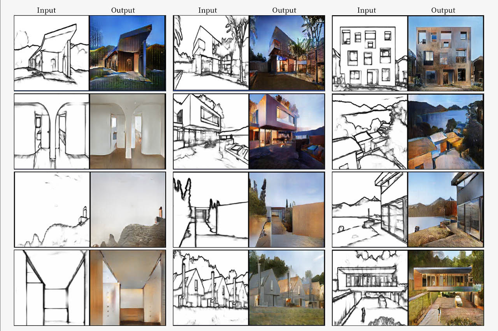

This is a pretrained model for Pix2Pix written by [Jun-Yan Zhu](https://github.com/junyanz)<br>



Due to the file size limit of GitHub, the pretrained model is provided in a Dropbox [link](https://www.dropbox.com/s/w1netgcq7qkir74/checkpoints.zip?dl=0).<br>

# To test with this pretrained model
Clone the model provided by Jun-Yan Zhu.<br>
Clone the sample dataset and pretrrained model on this page and put them in corresponding directories.<br>
Then generate the results using<br>
```bash
python test.py --dataroot ./datasets/architect_shader/ --direction BtoA --model pix2pix --name architect_shader
```
